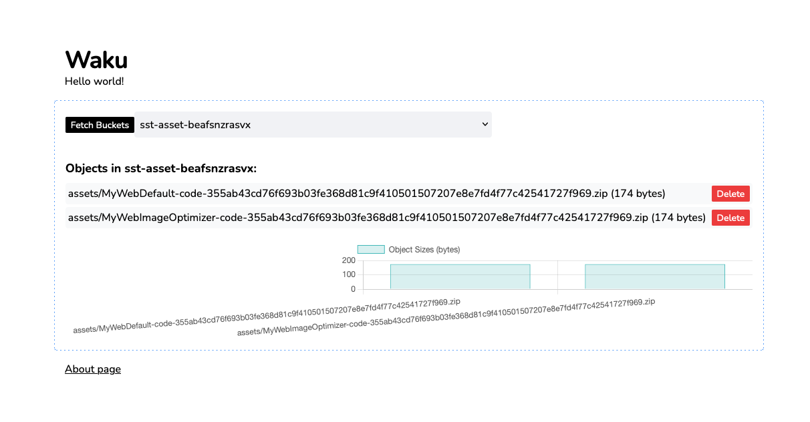

# React Actions AWS

A quick demo of using react server actions to interface with the AWS SDK.

## Getting started

Make sure to have valid AWS credentials in ENV

```
pnpm install
pnpm dev
```

## Note

This was pretty much entirely propmpted via cursor.sh in a couple of minutes.


## Video

## Video

Here is a quick demo video showcasing the project:

[](waku-aws.mp4)
